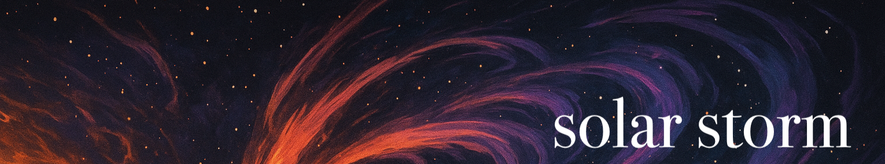

# Solar Storm dark theme
 
Solar Storm is a minimal VSCode theme inspired by the raw power and beauty of cosmic solar activity. It blends deep, futuristic tones with bursts of energetic colour, creating a workspace that feels both focused and alive. 

Designed with minimalism in mind, Solar Storm avoids visual clutter and focuses on clean contrasts, making it ideal for long coding sessions. Its futuristic aesthetic offers a calm backdrop for thought, with moments of radiant colour to keep you engaged and inspired.

 
 
 

<b>create. beautiful. code.</b>

James Gulland © | Find me on Bluesky.
